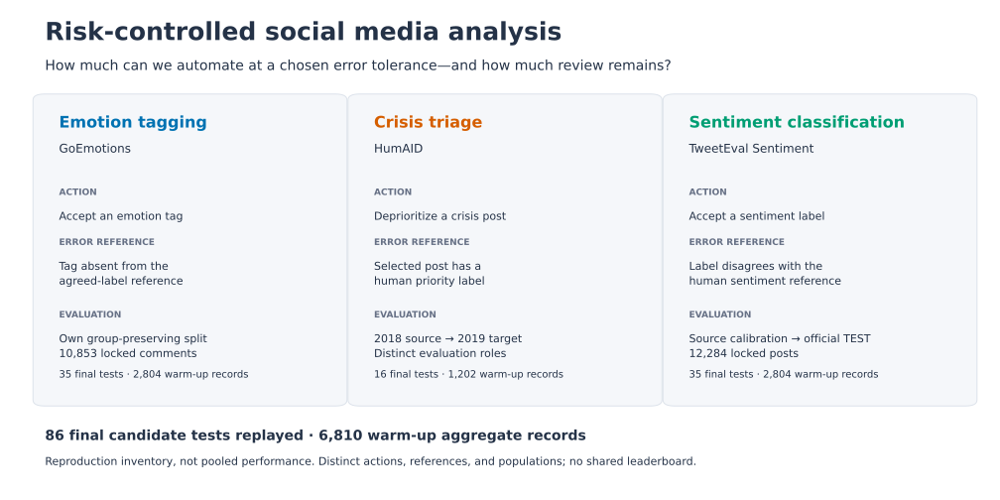

# Risk-controlled social media analysis

**How much social media analysis can we automate at a chosen error tolerance—and how much calibration data and human review does that require?**

Research on uncertainty quantification for **emotion tagging, sentiment classification, and crisis triage under explicit error budgets**. Three studies turn frozen model scores into policies that either act automatically or leave a post for review, then investigate the consequences for automation, annotation requirements, and calibration across populations.



**Version status:** this checkout prepares the **v0.2.0 release candidate**. The published [v0.1.0 release](https://github.com/asguinea/risk-controlled-social-media-analysis/releases/tag/v0.1.0) contains GoEmotions only and remains unchanged. See the [candidate notes](docs/releases/v0.2.0.md) for the expansion and remaining publication checks.

## Explore the studies

| Application and study | Research question | Result to investigate |
| --- | --- | --- |
| **[Emotion tagging · GoEmotions](experiments/goemotions/README.md)** | How useful is selective tagging when unsupported tags must be rare? | Both the 5% and 10% budgets accept fewer than 5% of 10,853 locked comments. |
| **[Crisis triage · HumAID](experiments/humaid/README.md)** | How do calibration-label requirements and priority errors change across event-year populations? | At a 5% budget, the 2018 source policy deprioritizes 13.88% of locked posts, with 3.39% priority contamination. Transfer and local calibration use separate evaluation roles. |
| **[Sentiment classification · TweetEval](experiments/tweeteval-sentiment/README.md)** | How do error tolerance and calibration size affect automation and class coverage? | The 2.5% budget returns review-all; the 15% policy automates 43.41% of official TEST with 15.1884% observed error. |

These are distinct tasks and references. An emotion error is an unsupported tag, a crisis error is a priority post being deprioritized, and a sentiment error is disagreement with the human label. The [three-study research note](docs/social-media-research.md) explains what connects them and how to interpret the populations, unsuccessful outcomes, and descriptive slices.

## Reproduce the evidence

The candidate replays **86 executed final-calibration tests** and regenerates summaries from **6,810 warm-up aggregate records**. Those totals describe the reproduction inventory; they do not pool study performance. All three workflows run without datasets, model weights, a GPU, credentials, or an EyeTrustAI product checkout.

Install [uv](https://docs.astral.sh/uv/getting-started/installation/), then run from this checkout or its candidate source archive:

```sh
uv sync --locked
uv run --locked uqrc goemotions --evidence experiments/goemotions/evidence --output results/goemotions/replay.json --report results/goemotions/tables.md
uv run --locked uqrc humaid --evidence experiments/humaid/evidence --output results/humaid/replay.json --report results/humaid/tables.md
uv run --locked uqrc tweeteval-sentiment --evidence experiments/tweeteval-sentiment/evidence --output results/tweeteval-sentiment/replay.json --report results/tweeteval-sentiment/tables.md
```

The package distribution remains `uncertainty-risk-control`, with Python import `uncertainty_risk_control` and CLI `uqrc`. The repository name makes the application domain explicit while preserving those existing interfaces.

To regenerate all seven figures, including the study map:

```sh
uv sync --locked --group figures
uv run --locked --group figures python experiments/goemotions/scripts/plot_results.py --evidence experiments/goemotions/evidence --output results/goemotions/figures
uv run --locked --group figures python scripts/plot_social_media_studies.py --output results/social-media
```

The [reproduction guide](docs/reproduction.md) covers outputs, the source archive versus wheel, and full verification. Calibration replay checks the executed sufficient statistics, including first failures. Aggregate regeneration does not reconstruct all historical warm-up candidate prefixes, retrain the models, or authenticate their original predictions. `status: PASS` refers to the specified computational checks.

## Method and interpretation

The [exact-binomial method](docs/method.md) tests a frozen candidate sequence, stops at the first failure, and chooses the largest selected set in the passing prefix. Empty selection means `REVIEW_ALL`, with undefined conditional error. The [small walkthrough](examples/selected_risk_walkthrough.py) and [verification workflow](docs/verification.md) make these decisions inspectable.

The target is error **among automatically selected outputs**. Each risk budget uses delta 0.05 separately, under explicit sampling and protocol assumptions. This does not provide a simultaneous guarantee across budgets, classes, events, or studies, and a source-population certificate does not automatically transfer under distribution shift. Warm-up bands are descriptive; full-pool results are single runs. Human annotation references and grouping do not establish objective truth or independence.

## Author, research context, and reuse

Maintained by **Alejandro Sanchez Guinea**, owner of **EyeTrustAI**, where the underlying validation research originated. This personal repository focuses on uncertainty research, experimental protocols, implementation, and reproducibility. The [contribution statement](docs/contributions.md) credits the existing statistical methods, datasets, and base models.

A planned EyeTrustAI companion repository will connect immutable research releases to product implementations and validation requirements. It will disclose shared ownership and evidence; the same benchmark does not become an independent replication or establish product readiness.

Use [CITATION.cff](CITATION.cff) and cite the underlying methods, datasets, and models applicable to your use. The candidate's [portfolio and article drafts](docs/portfolio.md) include figure links and precise wording for later publication.

Original included material is under [Apache-2.0](LICENSE), with [license scope](LICENSE_SCOPE.md) and [third-party notices](THIRD_PARTY_NOTICES.md). Published study assets are aggregate projections, code, documentation, and derived figures. Source posts, row-level records, identities, model weights, and product runtime are excluded.
