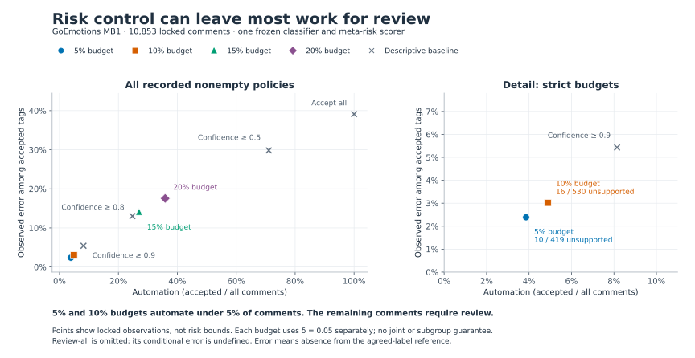
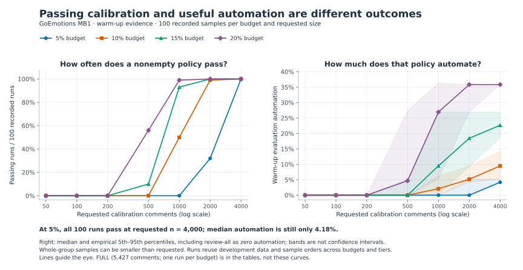

# GoEmotions MB1 figures

The two figures are derived from the verified aggregate evidence. Their [generator](../../scripts/plot_results.py) first replays final calibration and checks the evidence bundle, then renders the charts. [plot_data.json](plot_data.json) records the exact numerical inputs, denominators, manifest and generator hashes, reference-core integrity, plotting environment, and display conventions. It also retains full-pool and subgroup summaries for context.

## Locked risk and automation



**Caption.** GoEmotions MB1, 10,853 comments in the study's own locked role. Colored markers show four separately calibrated risk-budget policies; gray crosses show recorded confidence filters and accept-all as descriptive comparators. The right panel enlarges the strict-budget region; its count labels are unsupported tags divided by accepted tags. At 5% and 10% risk budgets, automation is 3.8607% and 4.8834%, with 10/419 and 16/530 unsupported tags respectively. Points are descriptive locked rates, not risk bounds, confidence intervals, or an estimated continuous frontier. Each budget uses delta 0.05 separately under the method's assumptions; no joint or subgroup guarantee is claimed. Review-all has undefined conditional error and is omitted from the scatter, while remaining in the tables and numerical inputs. An error means the top tag is absent from the complete set of labels supported by at least two recorded raters, not a mismatch with psychological truth. [All policy counts](../results.md#locked-baselines).

Downloads: [SVG](risk_automation.svg) · [PNG, 2160 × 1116](risk_automation.png).

## Calibration sample size



**Caption.** Recorded GoEmotions MB1 warm-up study, with 100 whole-group-prefix samples per budget and requested calibration size. The left panel shows the fraction of runs returning a passing nonempty controller. The right shows median automation on the same 5,426-comment warm-up evaluation role; bands are empirical 5th–95th percentiles over all 100 runs, including review-all as zero automation. Bands are not confidence intervals. Sample sizes on the logarithmic horizontal axis are requested sizes; realized counts can be smaller because groups are kept whole. Shared development data and sample orders across budgets and tiers mean these runs are not independent replications. Lines guide the eye between recorded tiers, without estimating intermediate values. The full 5,427-comment pool has one run per budget and is omitted from the curves; its records remain in the inputs and [complete summary table](../results.md#warm-up-sample-size-summaries). At the 5% budget, all 100 runs pass at requested n = 4,000, while median automation remains 4.1836%. These are aggregate summaries; original sample orders and warm-up candidate prefixes are not reproduced.

Downloads: [SVG](calibration_size.svg) · [PNG, 2160 × 1116](calibration_size.png).

## Regenerate

From the repository root:

```sh
uv sync --locked --group figures
uv run --locked --group figures python experiments/goemotions/scripts/plot_results.py \
  --evidence experiments/goemotions/evidence \
  --output results/goemotions/figures
```

The optional `figures` group pins Matplotlib 3.10.7 and locks its dependencies. The base method and replay installation does not need Matplotlib. Plotting requires the source checkout or source archive; the script and study assets are not included in the wheel. Once dependencies are installed, rendering requires no network, raw dataset, model, or private artifact.

The command writes exactly five generated files: two SVGs, two PNGs, and `plot_data.json`. It checks the evidence before creating output. Timestamps are omitted and SVG IDs are deterministic. Identical bytes were checked in the recorded local environment; other platforms can render fonts or images differently without changing the numerical inputs. To refresh the tracked assets intentionally, use `experiments/goemotions/report/figures` as the output directory.

## Attribution and reuse

Original figures: Alejandro Sanchez Guinea, *Uncertainty and risk control*, GoEmotions MB1; developed in connection with EyeTrustAI, owned by the maintainer. Use the software version/release in [CITATION.cff](../../../../CITATION.cff) when citing the repository, and also credit the [GoEmotions authors](https://aclanthology.org/2020.acl-main.372/). Original derived figures are within the [Apache-2.0 scope](../../../../LICENSE_SCOPE.md). Preserve the scientific qualifications in these captions when reusing an image.
