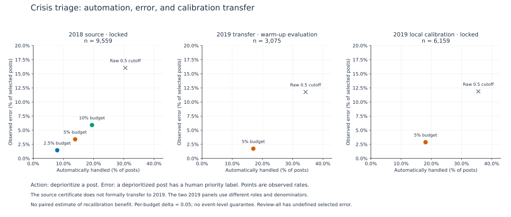

# HumAID: risk-controlled crisis-post deprioritization

**How much crisis-post review can a frozen scorer avoid under a selected-risk constraint, and what changes when calibration moves to a new event-year population?**

This humanitarian-research study investigates uncertainty through a concrete action: automatically deprioritizing a post whose score suggests it lacks a priority signal. A harmful selection is a deprioritized post carrying one of the study's seven priority categories. The reference is HumAID's released human-agreed category, not verified incident truth.

**Included in v0.2.0.** The published v0.1.0 release contains GoEmotions only and remains unchanged. See the [release notes](../../docs/releases/v0.2.0.md).

The primary source policy automates 13.88% of 9,559 locked posts, with 3.39% priority contamination among selected posts. The source study retains its 2.5%, 5% and 10% risk budgets. The 2019 series uses the same frozen scorer, observes source-policy transfer on a development role, and separately calibrates and evaluates a target policy. Its locally calibrated locked result is 18.10% automation and 2.87% selected error. These results use different populations; their difference does not measure a causal benefit from recalibration.



[Full captions, counts and calibration-size figure](report/figures/README.md) · [Three-study research note](../../docs/social-media-research.md)

| Read or run | Purpose |
| --- | --- |
| [Protocol](protocol.md) | Action, loss, scorer, role sizes, frozen order and assumptions |
| [Generated results](report/results.md) | All four final controllers, pooled results, baselines, event slices, and both warm-up series |
| [Reproduction contract](reproduction.md) | Runnable scope, commands and limitations |
| [Provenance](provenance.md) | Source correspondence, controlled count projection and original-function extraction |
| [Evidence manifest](evidence/manifest.json) | Hashes for the aggregate bundle and projection/aggregation implementation |

From the repository root:

```sh
uv sync --locked
uv run --locked uqrc humaid --evidence experiments/humaid/evidence --output results/humaid/replay.json --report results/humaid/tables.md
```

The replay checks **16 final-calibration tests** and regenerates **1,202 warm-up records** without a dataset download, model, GPU or product checkout. It is aggregate reproducibility, not an independent replication or an end-to-end model experiment. The [figure guide](report/figures/README.md) explains the regenerated plots and their limitations.

## Attribution and asset boundary

HumAID: Firoj Alam, Umair Qazi, Muhammad Imran and Ferda Ofli (2021), [HumAID: Human-Annotated Disaster Incidents Data from Twitter with Deep Learning Benchmarks](https://ojs.aaai.org/index.php/ICWSM/article/view/18116), DOI `10.1609/icwsm.v15i1.18116`. See the [official dataset page](https://crisisnlp.qcri.org/humaid_dataset.html) and [CrisisNLP terms](https://crisisnlp.qcri.org/terms-of-use.html).

This repository includes original research code, aggregate statistics and analysis. It excludes tweets, tweet IDs, row labels/scores, assignment maps, identity keys and models. Its Apache-2.0 license does not grant rights to the underlying dataset. Read [third-party notices](../../THIRD_PARTY_NOTICES.md#humaid) and [license scope](../../LICENSE_SCOPE.md).

The work originated in EyeTrustAI's validation research and is maintained by Alejandro Sanchez Guinea, its owner. This personal repository emphasizes uncertainty research and reproducibility. It is not product certification, deployment evidence, or an independent replication by another organization.
