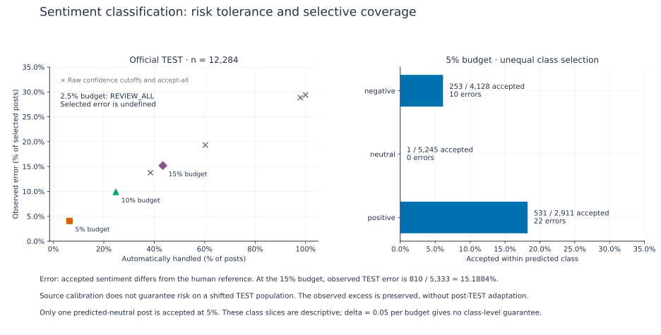

# TweetEval Sentiment: risk tolerance, automation and calibration labels

**How much sentiment tagging can a frozen classifier automate at a chosen error tolerance, and how much calibration evidence does that require?**

The study accepts a model's negative, neutral or positive tag only when its uncertainty score is below a calibrated threshold. An error means the accepted tag differs from the benchmark's released human reference. This is a study of selective prediction and review workload, not an assertion of objective sentiment, customer intent or factual truth.

**Included in the local v0.2.0 release candidate.** The published v0.1.0 release contains GoEmotions only and remains unchanged. See the [candidate notes](../../docs/releases/v0.2.0.md).

| Risk budget | Locked automation | Wrong accepted / accepted | Observed selected error |
| --- | ---: | ---: | ---: |
| 2.5% | 0% | 0 / 0 | undefined; review all |
| 5% | 6.3904% | 32 / 785 | 4.0764% |
| 10% | 24.7558% | 301 / 3,041 | 9.8981% |
| 15% | 43.4142% | 810 / 5,333 | 15.1884% |

The strictest budget passes in a single full-pool development warm-up but fails in final calibration. The 15% observed test result exceeds its nominal budget and remains visible. Official TEST is a separate population from the train/validation source calibration pool, with different reference-class proportions. Calibration is not a guarantee for an arbitrarily shifted population.



[Full captions, counts and calibration-size figure](report/figures/README.md) · [Three-study research note](../../docs/social-media-research.md)

| Read or run | Purpose |
| --- | --- |
| [Protocol](protocol.md) | Reference, scorer, data roles, development order and assumption limits |
| [Generated results](report/results.md) | Final tests, locked frontier, baselines, class slices, warm-up summaries |
| [Reproduction contract](reproduction.md) | Runnable scope and missing historical inputs |
| [Provenance](provenance.md) | Controlled count projection and preserved aggregation logic |
| [Evidence manifest](evidence/manifest.json) | Bundle and implementation hashes |

From the repository root:

```sh
uv sync --locked
uv run --locked uqrc tweeteval-sentiment --evidence experiments/tweeteval-sentiment/evidence --output results/tweeteval-sentiment/replay.json --report results/tweeteval-sentiment/tables.md
```

The command checks **35 final candidate tests** and **2,804 warm-up aggregate records** without source tweets, model weights, an identity key or a private checkout. It reuses the published exact-binomial method. Complete warm-up candidate-prefix reconstruction and historical training/inference remain outside scope.

This addition covers Sentiment D1/D2. The separately completed Negative N1/N2 follow-up studies remain a later publication series, with their different action/loss definitions and retrospective evidence chronology. The [figure guide](report/figures/README.md) documents the regenerated plots and their limitations.

## Attribution and relationship

Cite [TweetEval](https://aclanthology.org/2020.findings-emnlp.148/) (Barbieri et al., 2020), the underlying [SemEval-2017 Task 4 sentiment task](https://aclanthology.org/S17-2088/), and [BERTweet](https://aclanthology.org/2020.emnlp-demos.2/) as applicable. The historical source is pinned to Cardiff NLP revision `4fbd22cd78421f05b1ecdb4fc5725bc7a7bd8f66`.

Maintained by Alejandro Sanchez Guinea, owner of EyeTrustAI. This personal research repository makes the methods and aggregate evidence inspectable; it is not an independent replication by another organization or evidence of product readiness. See [contribution context](../../docs/contributions.md), [license scope](../../LICENSE_SCOPE.md), and [TweetEval notices](../../THIRD_PARTY_NOTICES.md#tweeteval-sentiment-and-bertweet).
